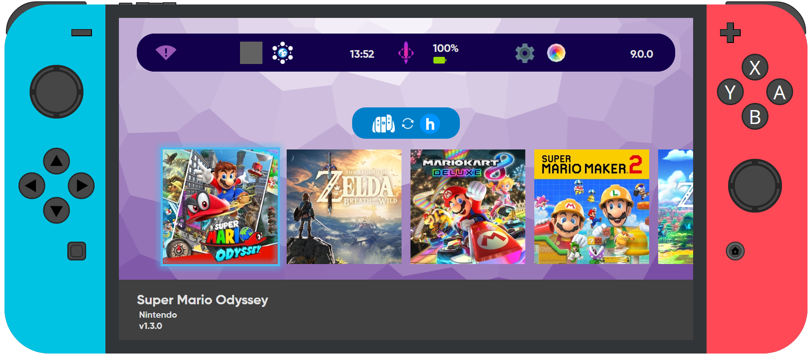
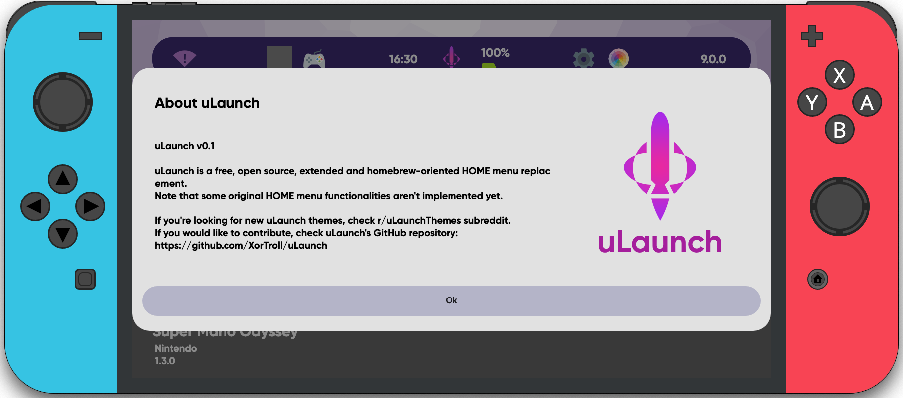
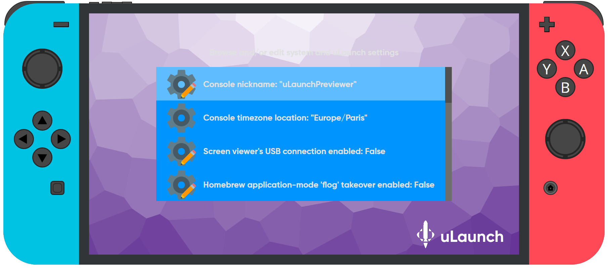
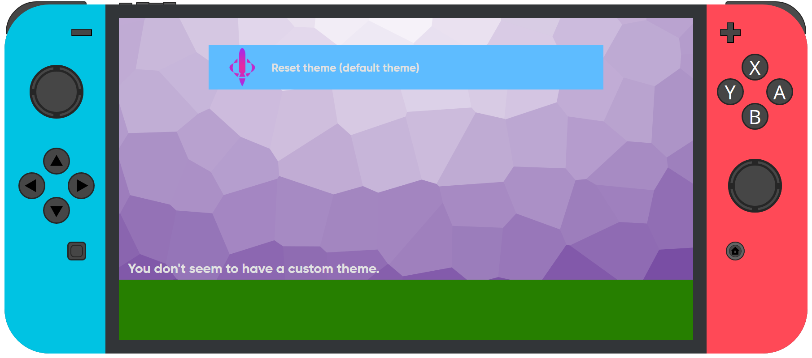

<h1 align="center" style="font-family: 'Font';">uLaunch-Previewer</h1>

<h3>uLaunch Previewer is a project for Test uLaunch before installing it in your switch or to preview your themes</h3>

 
 

## Download

| Platform | File Download |
| -------- | ---- |
| Windows x64 | [`uLaunch-Previewer-0.1.0.exe`](https://github.com/IcosaSwitch/uLaunch-Previewer/releases/download/v0.1/uLaunch-Previewer-0.1.0.exe) |
| macOS | [`uLaunch-Previewer-0.1.0.dmg`](https://github.com/IcosaSwitch/uLaunch-Previewer/releases/download/v0.1/uLaunch-Previewer-0.1.0.dmg) |
| Linux x64 | [`uLaunch-Previewer-0.1.0.deb`](https://github.com/IcosaSwitch/uLaunch-Previewer/releases/download/v0.1/IcosaSwitch-1.7.0.deb) [`uLaunch-Previewer-0.1.0.AppImage`](https://github.com/IcosaSwitch/uLaunch-Previewer/releases/download/v0.1/IcosaSwitch-1.7.0.AppImage) |

## Credits

XorTroll for uLaunch: https://github.com/XorTroll/uLaunch/
